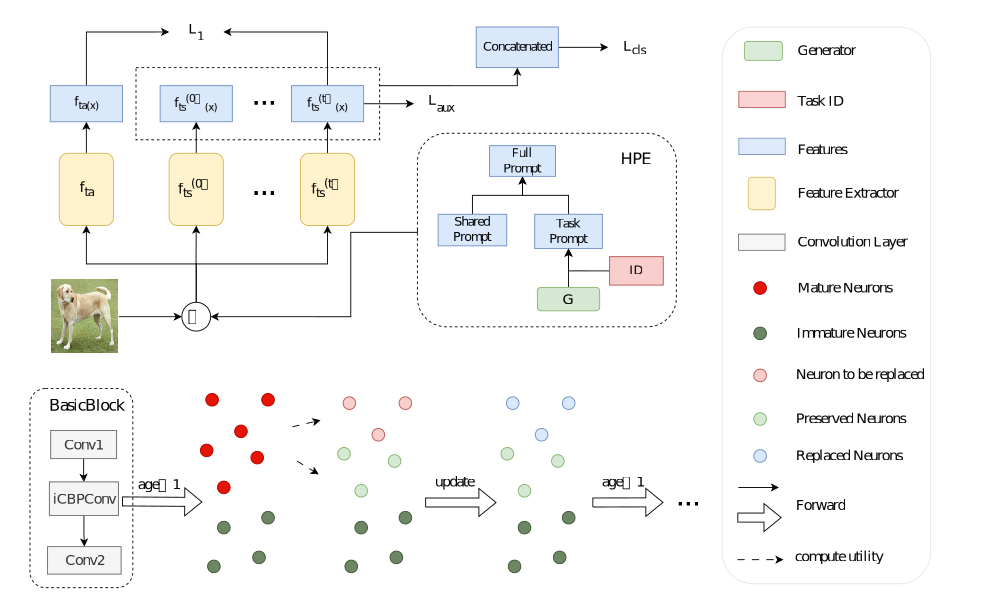

# Adaptive Neuron Management for Class-Incremental Learning



## To Run the Code

Package Requirements

```
pytorch torchvision torchmetrics loguru tqdm
```

Example:

``` bash
python main.py train --exp-configs configs/all_in_one/cifar100_10-10_anm_resnet18.yaml --log-dir ./logs/exp_cifar100_10-10
```

Other useful arguments:

``` bash
--exp-name # name the experiment
--log-dir # the folder to output log files
--ckpt-dir # the folder to checkpoint
--output-file-prefix # the filename prefix of output file
```

For more arguments, see [`argument.py`](utils/argument.py).

## Acknowledgements

This repository is inspired by [PyCIL](https://github.com/G-U-N/PyCIL).
